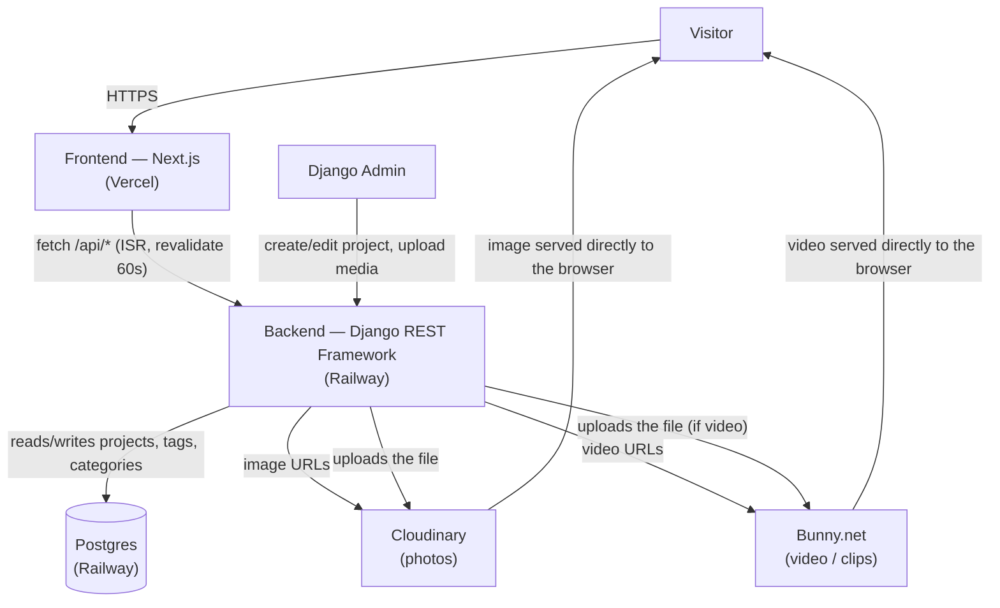

# Architecture & Costs — Julian Jeffreys Portfolio

## 1. System flow

**How it works in practice:**

1. A visitor lands on `design-portfolio-puce-nine.vercel.app` (Vercel serves the Next.js app).
2. Every page (`/`, `/portfolio`, `/about`, `/contact`) requests data from the Django API hosted on Railway (`designportfolio-production-...up.railway.app/api/...`).
3. Django never stores the actual image/video files on its own disk — when a file is uploaded from the admin, it's sent to Cloudinary (photos) or Bunny.net (video), and only the resulting **URL** is saved in Postgres.
4. When the browser requests an image, it fetches it directly from Cloudinary/Bunny — Railway never moves that weight, it only ever hands out URLs.
5. Next.js caches API responses for 60 seconds (ISR) so it isn't hitting Railway on every single visit.

**Why the media hosting is split across two providers instead of one:**
- Cloudinary bills video against the same shared credit pool as photos, and video burns through credits far faster per GB. Routing video to Bunny.net instead keeps a handful of videos from eating the whole plan.
- Railway/Vercel both charge for egress (outbound data transfer) — serving heavy images from either one costs more than a CDN built specifically for that job.

---

## 2. Cost plan by traffic tier

Based on the services currently in use: **Vercel** (frontend), **Railway** (backend + Postgres), **Cloudinary** (photos), **Bunny.net** (video). These figures are reference estimates from each provider's public 2026 pricing pages — actual spend depends on exact image/traffic volume.

### Tier 1 — Personal portfolio (low traffic)
*A few hundred visits/month, current catalog (~25 projects, ~130 images, no heavy video yet)*

| Service | Plan | Cost |
|---|---|---|
| Vercel | Hobby (free, personal/non-commercial use) | $0 |
| Railway | Hobby ($5/mo includes $5 of usage credit) | $5/mo |
| Cloudinary | Free (25 credits/mo) | $0 |
| Bunny.net | Pay-as-you-go, no real video yet | ~$1/mo |
| **Estimated total** | | **~$6/mo** |

### Tier 2 — Growing usage (active freelancer, portfolio shared with clients)
*Thousands of visits/month, larger catalog with video, commercial traffic*

| Service | Plan | Cost |
|---|---|---|
| Vercel | Pro ($20/user/mo, commercial use allowed, 1 TB included) | $20/mo |
| Railway | Hobby + usage (RAM ~$10/GB-mo, vCPU ~$20/vCPU-mo, egress ~$0.05/GB) | ~$10–20/mo |
| Cloudinary | Free, or Plus if storage/transformations are exceeded (225 credits, $99/mo) | $0–99/mo |
| Bunny.net | Storage $0.01/GB + delivery from $0.01/GB | ~$5–15/mo |
| **Estimated total** | | **~$35–150/mo** (the big jump happens only if Cloudinary Plus becomes necessary) |

### Tier 3 — Studio/agency portfolio (high traffic, many video-heavy projects)
*Tens of thousands of visits/month, campaign traffic spikes, large catalog*

| Service | Plan | Cost |
|---|---|---|
| Vercel | Pro + bandwidth overage ($0.15/GB above 1 TB) | $20 + variable |
| Railway | Scaled usage (CPU/RAM/egress) | ~$40–80/mo |
| Cloudinary | Plus or Advanced (600 credits, $249/mo) if video volume grows | $99–249/mo |
| Bunny.net | Still the cheapest piece of the stack for heavy video | ~$20–50/mo |
| **Estimated total** | | **~$180–400/mo** |

### Where the cost actually jumps
- **Cloudinary is always the biggest risk** once photo volume or transformations scale up — that's exactly why video was routed to Bunny.net from the start instead of Cloudinary.
- **Railway** stays predictable at low/medium traffic; at Tier 3 it's worth checking whether a fixed-instance Postgres plan beats the usage-based model.
- **Vercel Hobby forbids commercial use** — the moment the portfolio is actively used to land clients (Tier 2+), upgrading to Pro is a terms-of-service requirement, not just a technical limit.

---

## Pricing sources consulted (2026)
- [Railway Pricing 2026: Free Plan, Postgres & Alternatives](https://www.srvrlss.io/provider/railway/)
- [Railway Pricing Calculator (2026)](https://makerkit.dev/pricing-calculator/railway)
- [Vercel Pricing 2026: Plans, Limits & Hidden Costs](https://deploywise.dev/blog/vercel-pricing-explained)
- [Vercel Free vs Pro Plan in 2026](https://www.fencode.dev/en/blog/vercel-free-vs-pro-2026-official-limits-pricing)
- [Cloudinary Pricing Tiers & Costs (Updated for 2026)](https://thedigitalprojectmanager.com/tools/cloudinary-pricing/)
- [Cloudinary Pricing Explained (2026)](https://theimagecdn.com/docs/cloudinary-pricing)
- [Bunny Storage Pricing](https://bunny.net/pricing/storage/)
- [Bunny.net Pricing 2026](https://pricingnow.com/question/bunny-pricing/)
